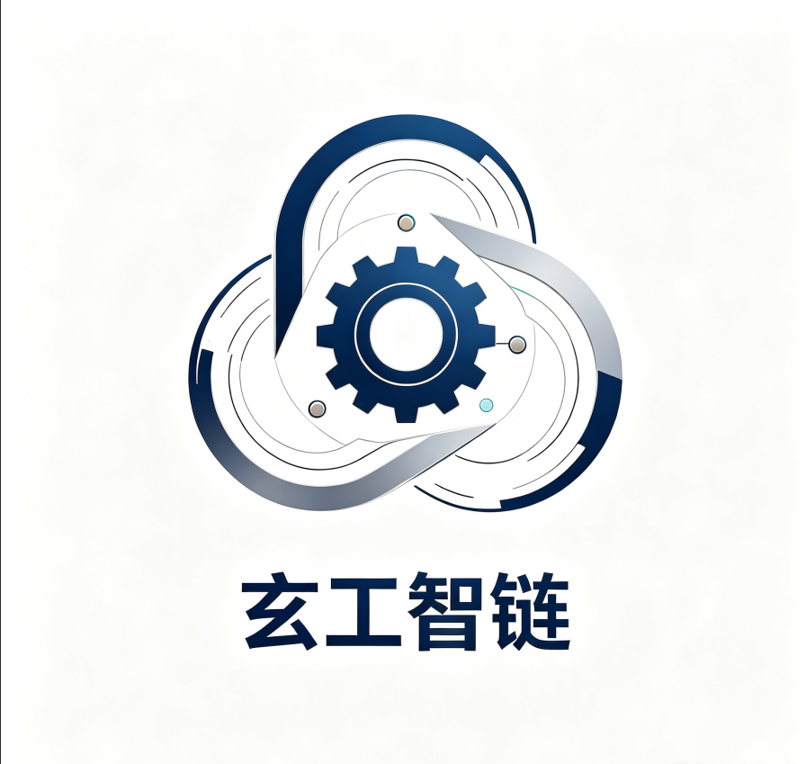
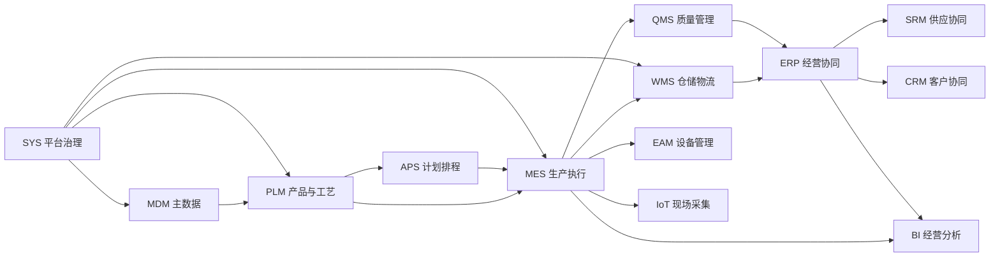
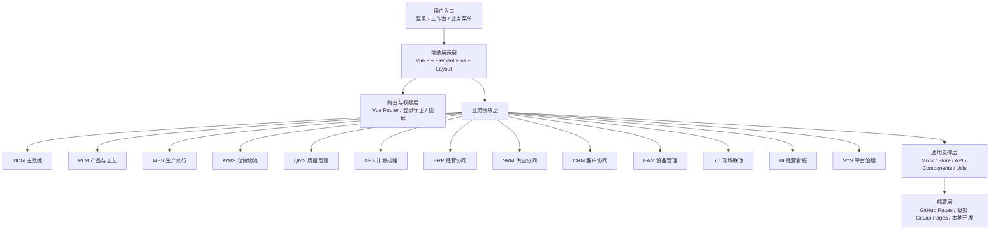

# 玄工智链 XIC Platform

<p align="center">
  
</p>

<p align="center">
  面向离散制造企业的一体化数字化平台前端工程，聚焦 <strong>从主数据到生产执行、从仓储质量到经营协同</strong> 的完整业务主线。
</p>

<p align="center">
  
  
  
  
  
  
</p>

<p align="center">
  <a href="https://xuanlian-7b0b78.pages.jihulab.net/login">国内直连（免翻墙）</a>
  ·
  <a href="https://squirtles331.github.io/Xuangong-SmartChain/">GitHub 访问（部分网络环境需翻墙）</a>
  ·
  <a href="./玄工智链_一体化平台开发参考总册_V1.0.md">开发总册</a>
  ·
  <a href="./docs">设计与规划文档</a>
</p>

## 📝 项目定位

玄工智链不是简单的中后台模板，也不是只展示几个 CRUD 页面的 Demo。

它更像是一套面向制造业业务链路的前端展示基座：

- 先把业务主线讲清楚
- 再把模块边界讲清楚
- 再把页面、状态、对象、路由讲清楚
- 最后再接 Mock、API、权限、审批、打印和报表

## 🚀 在线预览

- 国内直连地址（极狐 GitLab Pages，免翻墙）：
  [https://xuanlian-7b0b78.pages.jihulab.net/login](https://xuanlian-7b0b78.pages.jihulab.net/login)
- GitHub 访问地址（GitHub Pages，部分网络环境需翻墙）：
  [https://squirtles331.github.io/Xuangong-SmartChain/](https://squirtles331.github.io/Xuangong-SmartChain/)

## 🖼️ 界面预览


## 🧭 系统主线



## 🏗️ 系统架构



## ✨ 商业化卖点

- 一体化制造视角：围绕制造业务主线组织页面，而不是把模块孤立堆叠
- 可演示可评审：静态页、Mock 场景和路由体系已具备完整展示能力
- 可继续扩展：后续可逐步接入真实 API、权限、审批、打印和报表
- 可二开落地：页面结构、模块边界和通用组件适合持续沉淀
- 双通道部署：同时支持国内直连和 GitHub Pages 访问

## 🧩 功能总览

### 🗃️ 基础数据与产品定义

- `MDM`：物料、物料分类、单位、仓库、库区、库位、组织、部门、班组、工作中心、编码规则、共享基础数据
- `PLM`：产品定义、BOM、EBOM、MBOM、工艺路线、工序定义、工程变更、版本发布、BOM 对比、BOM 展开

### 🏭 计划与生产执行

- `APS`：主生产计划、生产排程、重排、工单排产视图、产能协同
- `MES`：销售订单、生产计划、装配工单、工单、任务、派工、报工、执行看板、工单追溯、异常、不良登记、返工

### 📦 仓储与库存

- `WMS`：入库单、出库单、收货入库、拣料出库、领料、退料、库存收发明细、库存余额、库存台账、盘点、调拨、条码管理、条码扫描、标签打印

### 🧪 质量管理

- `QMS`：常见缺陷、检测项管理、检测模板、来料检验单、过程检验单、出货检验单、不合格评审、质量裁决、返工/报废处理

### 🛠️ 设备、工具与现场

- `EAM`：设备类型设置、设备台账、点检保养项目、点检保养计划、维修单、点检保养工单
- `IoT`：设备连接、点位配置、采集、报警、现场联动
- `工具管理`：工具领用、工具归还、工装夹具类型、工装夹具台账

### 🤝 经营协同

- `ERP`：销售订单、采购申请、采购订单、委外订单、财务台账、成本核算、应收应付
- `SRM`：询报价、送货协同、对账协同、供应商协同
- `CRM`：客户档案、客户机会、客户订单跟踪、售后服务请求

### 📊 报表与看板

- `BI`：员工绩效、工资报表、不良品项分部、不良品项汇总、生产报表、产量统计、车间生产管控看板、工单执行进度看板、经营分析、质量分析、库存分析

### 🧑‍💼 平台治理

- `SYS`：用户管理、部门管理、消息推送、权限管理、角色管理、菜单设置、数据字典、系统日志、版本发布记录、定时任务、审批流程、我的任务、表单设计、表单配置、数据采集、代码生成、排班管理

## 🎯 按真实业务流程展开

### 1. 主数据与产品定义

这一层决定后面所有页面的对象口径。

- 物料、单位、仓库、库位、组织、班组
- 产品定义、BOM、工艺路线、工序、版本、工程变更
- 编码规则、共享基础数据、通知、车间设置

### 2. 计划与执行

这一层决定生产如何被下达、执行和反馈。

- 销售订单、生产计划、主生产计划
- 排程、重排、产能协同、工单排产视图
- 工单、任务、派工、报工、在制跟踪、追溯、异常

### 3. 仓储与质量

这一层决定物料怎么流转、质量怎么裁决。

- 入库、出库、领料、退料、调拨、盘点
- 库存收发明细、库存余额、库存台账、条码与标签
- 来料检验、过程检验、出货检验、不合格评审、返工/报废

### 4. 经营协同与分析

这一层决定企业如何看待订单、供应、客户和经营结果。

- 采购协同、供应商协同、客户协同
- 财务台账、成本核算、应收应付
- 员工绩效、工资报表、生产报表、产量统计、经营看板

### 5. 平台治理与扩展

这一层决定系统能不能持续交付和持续管理。

- 用户、角色、菜单、权限、日志、字典
- 定时任务、审批流程、表单设计、代码生成
- 排班、工具、消息、版本发布记录

## 🎁 当前状态

当前仓库更适合被理解为：

- 制造业平台的前端原型工程
- 多业务模块持续演进中的公开代码仓库
- 用于展示页面架构、模块拆分和静态交互方案的基础工程

## 🧰 技术栈

- `Vue 3`
- `TypeScript`
- `Vite`
- `Element Plus`
- `Pinia`
- `Vue Router`
- `ECharts`
- `Mock.js`
- `vxe-table`
- `Vitest`
- `ESLint`

## 🚦 快速开始

建议环境：

- `Node.js >= 20.18.0`
- `npm >= 11`

安装依赖：

```bash
npm install
```

启动开发环境：

```bash
npm run dev
```

本地默认访问地址：

```text
http://localhost:8099
```

## 🧪 常用命令

```bash
npm run dev
npm run build
npm run preview
npm run type-check
npm run lint:eslint
npm run test
```

## 🗂️ 目录结构

```text
src/
├─ api/                 接口层
├─ assets/              图片、图标与静态资源
├─ components/          通用组件
├─ layout/              布局系统
├─ mock/                Mock 数据
├─ router/              路由与菜单
├─ stores/              状态管理
├─ styles/              全局样式
├─ utils/               工具封装
└─ views/               业务页面
   ├─ plm/
   ├─ mes/
   ├─ wms/
   ├─ qms/
   ├─ aps/
   ├─ erp/
   ├─ srm/
   ├─ crm/
   ├─ eam/
   ├─ iot/
   ├─ bi/
   ├─ sys/
   └─ mdm/
```

## 📚 文档索引

- [玄工智链\_一体化平台开发参考总册\_V1.0](./玄工智链_一体化平台开发参考总册_V1.0.md)
- [玄工智链\_项目总览\_V1.0](./玄工智链_项目总览_V1.0.md)
- [玄工智链\_系统菜单架构与页面说明\_V1.0](./玄工智链_系统菜单架构与页面说明_V1.0.md)
- [以MES为核心一体化平台整体业务流程](./以MES为核心一体化平台整体业务流程.md)
- [CI-CD Setup Guide](./CI-CD-SETUP-GUIDE.md)
- [`docs/` 目录](./docs)

## 🚢 部署说明

- `GitHub Pages`
- `极狐 GitLab Pages`

重点关注：

- `.github/workflows/deploy.yml`
- `.gitlab-ci.yml`
- `vite.config.ts`
- `.env.github-pages`
- `.env.gitlab-pages`

## 🎪 适用场景

- 制造业数字化平台售前演示与原型交付
- 企业内部业务研讨、菜单规划与页面走查
- 前端团队先行搭建中后台业务骨架
- 后续 Mock、接口联调和真实业务实现的前端起点

## 📄 License

本项目使用 [MIT License](./LICENSE)。
